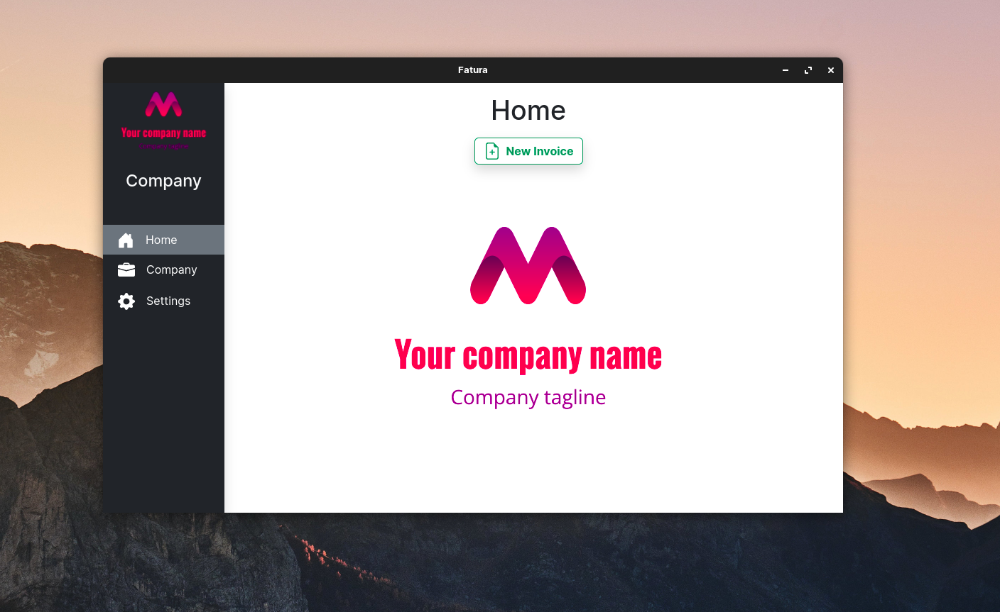
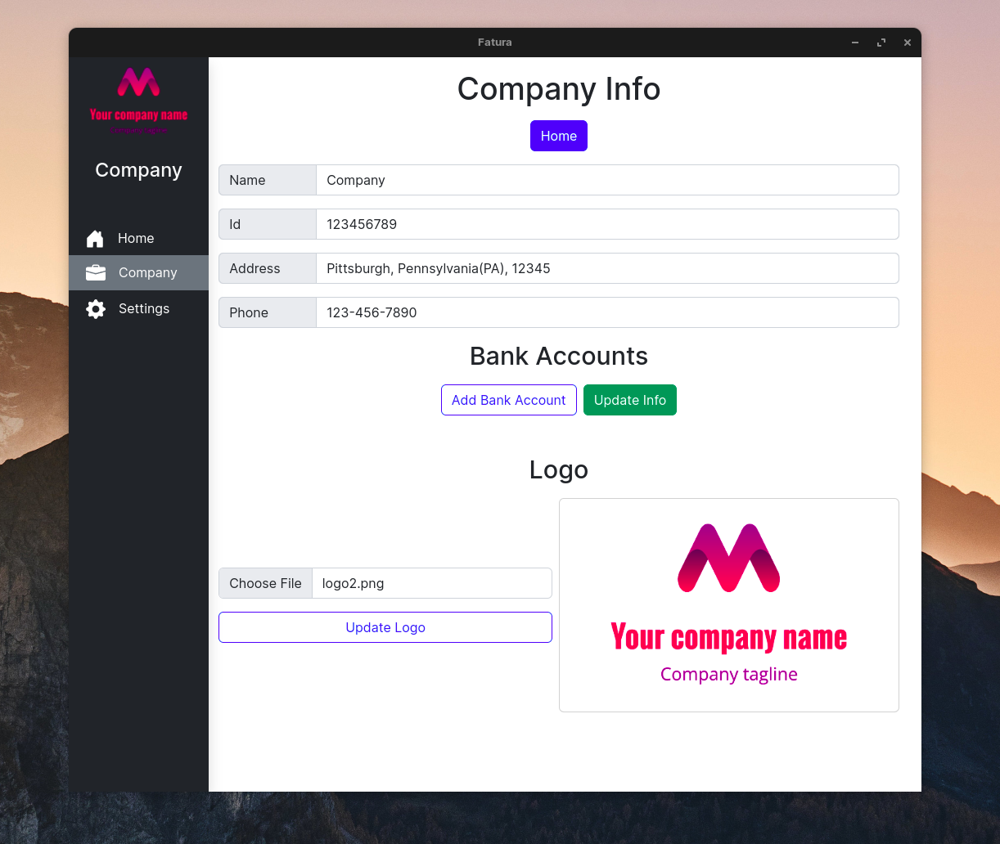
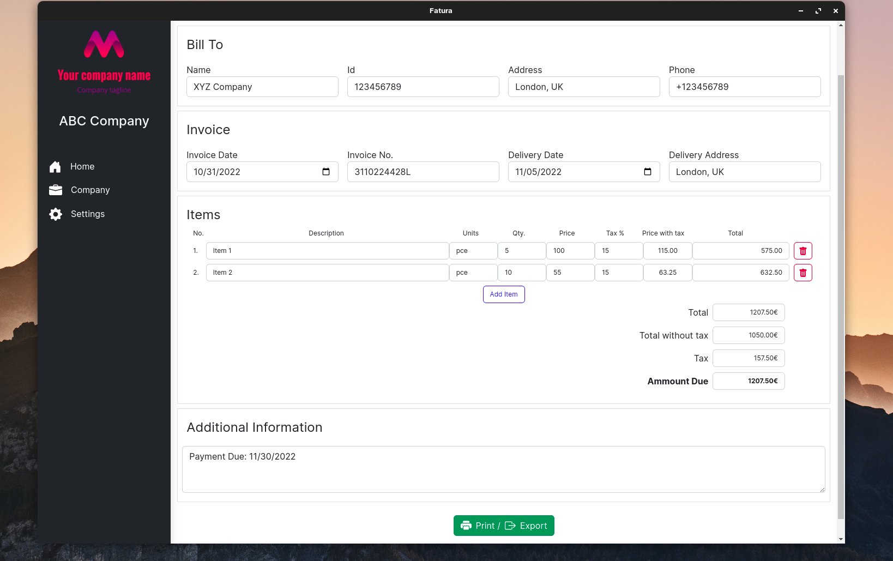
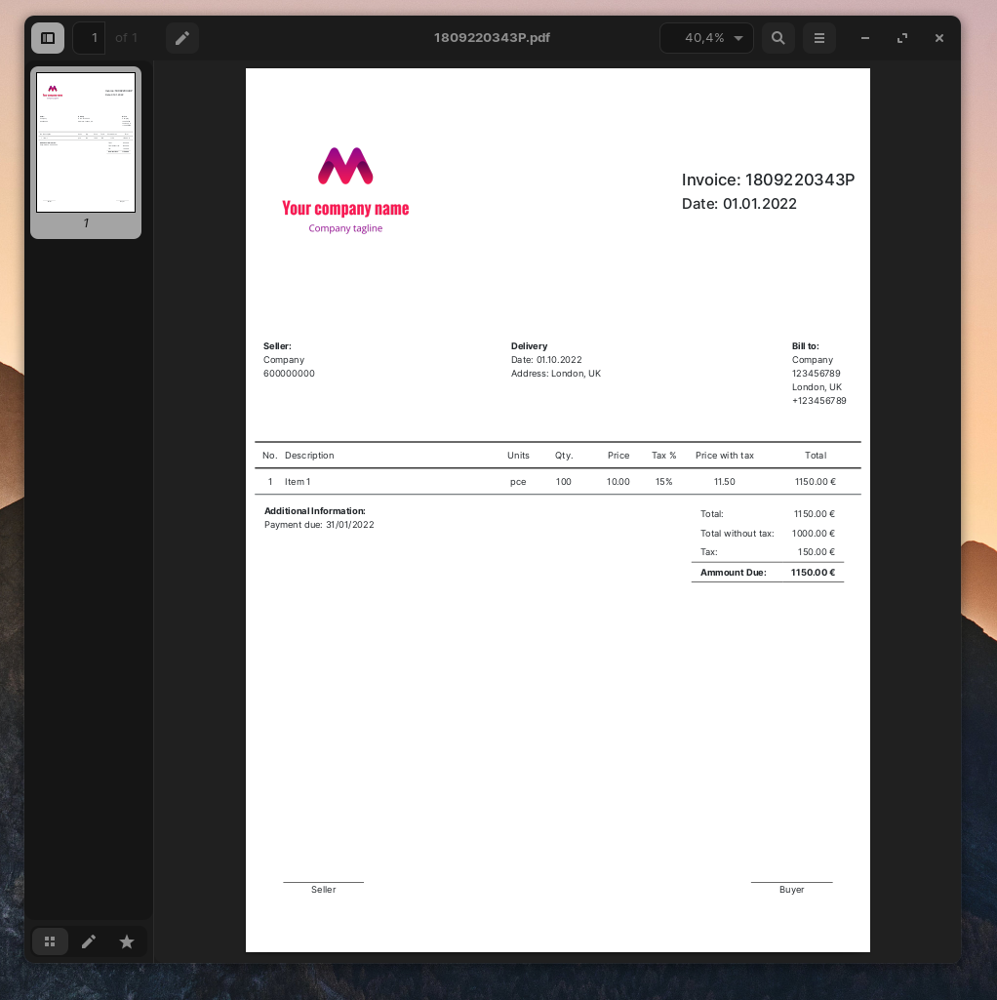

# About

**Fatura** is a free and open source multi-platform invoicing app. It's available for Linux and Windows.

Create and distribute invoices in an easy way. Print the invoice or save it as PDF to send electronically. Input your company information and logo once and it will be saved for each subsequent invoice.

The app is translated in two languages, and you can pick between most common date formats, as well as over 160 currencies.

 

#

## Built with

**Fatura** is built on the Electron framework, which allows for easy porting to any popular platform.

 

# Screenshots

  
Home Screen

  

  

  
Company Info

  

  

  
Create Invoice

  

  

  
Generated Invoice

  

  

  
Settings

  

  

 

# Installation

  
Linux

  

     Simply download the latest AppImage from <a href='https://github.com/liridonloku/fatura/releases'>Releases</a> and run it. No installation necessary.
  

  
Windows

  

     <ol>
      <li>
        Download the latest installer from <a href='https://github.com/liridonloku/fatura/releases'>Releases</a>.
      </li>
      <li>
        Run the installer. If a security message pops up (See <strong>Known issues</strong> below), click 'more' and then 'install anyway'. Follow the instructions to install the app.
      </li>
      <li>
        Launch the app from the desktop shortcut
      </li>
     </ol>
  

 

# Usage

This app is simple to use:

- Fill the information for your company in the Company Info page
- Create invoices from the Home page
- Chose the Language, Currency and Date Format in the Settings page

 

# Road map

## Known issues

- Due to security certificate requirements the app can't be installed on MacOS, and it displays a security risk message when installing on Windows.

 

## Features for future versions

- Keep a record of all issued invoices
- Allow saving of frequent customers and items
- UI/UX improvements

 

# Contact

Liridon Loku - liridonloku@gmail.com

 

# Acknowledgements

- Bootstrapped using [Electron React Boilerplate](https://github.com/electron-react-boilerplate)
- <a href="https://www.flaticon.com/free-icons/document" title="document icons">Document icons created by Freepik - Flaticon</a>
